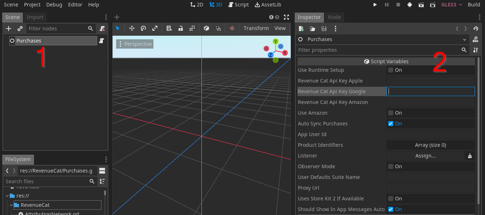
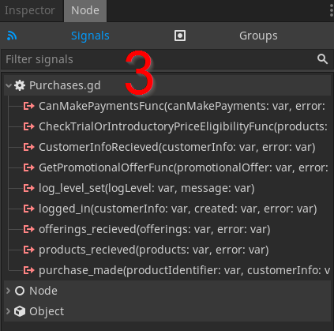

# What is purchases-godot?

Purchases Godot is a quick and dirty GDScript port of the RevenueCat [Purchases Unity](https://github.com/revenueCat/purchases-unity) SDK. This port was made using Godot 3.6beta3, and currently only support Android. iOS coming soon.

## Getting Started
Some prior familiarity with RevenueCat and their other SDK's (specifically Unity) is assumed.

To quickly get set up on a Godot project:

- Create a new scene in your project called "Purchases" (1)
- Add a simple Node to the scene, call it anything
- Attach the Purchases.gd script to that node
- Set the scene as an Autoload in Project Settings
- Input the values necessary in the Godot Editor scene Inspector (Google API Key, Product IDs, etc) (2)
- Connect to the exposed signals and consume them as needed in your business logic (3)
- Call functions as usual in RevenueCat ( ie Purchases.GetOffers() )

PurchasesWrapper.java will need to be turned into an Android plugin and included in your project, per the [Godot Documentation](https://docs.godotengine.org/en/3.6/tutorials/platform/android/android_plugin.html) about creating Android Plugins.

For more detailed information on RevenueCat itself, you can view their complete documentation at [docs.revenuecat.com](https://docs.revenuecat.com/docs/).